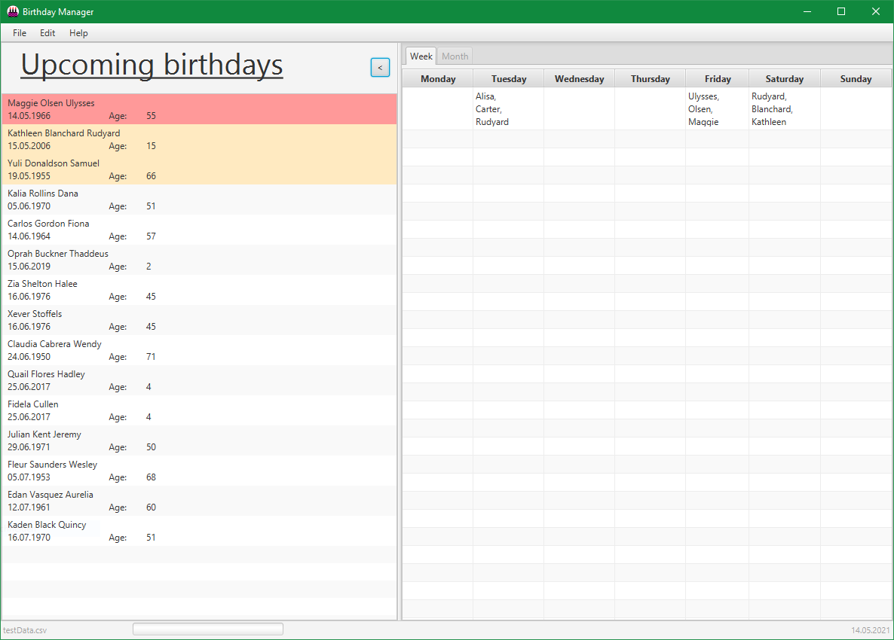

# BirthdayManager
A small Program to keep track of the birthdays you don't want to miss!

## Build and Run
Prefer the locally installed `gradle` command when it is available.
Use the wrapper only when a local Gradle installation is unavailable
or an environment explicitly requires it.

```bash
gradle run
gradle test
gradle build
gradle spotlessApply
gradle shadowJar
```

`gradle run` starts the app for local development.
`gradle shadowJar` builds the standalone executable JAR in `build/jar/`.
Run it with `java -jar build/jar/BirthdayManager-<version>-all.jar`.
The shaded JAR bundles JavaFX for macOS, Linux, and Windows,
so it only requires a compatible Java 21+ JVM.

#### Executable JAR Constraints

- The standalone JAR targets Java 21+.
- No separate JavaFX installation is required.
- The currently verified native coverage is Windows x64, Linux x64, and macOS arm64.
- Intel macOS and Windows ARM are not covered by the current shaded artifact.
- The JAR embeds JavaFX on the classpath, so JavaFX may still report an unnamed-module configuration warning at startup.
- The manifest includes `Enable-Native-Access: ALL-UNNAMED` for newer JDKs that warn about native access.

### Features:
* Light mode / Dark mode
* Localisation for English and German
* Manage birthdays
    * Multiple view keep you informed about the birthdays
      * Birthdays this week
      * The next birthdays
      * The last birthdays
    * Being notified if you missed a birthday
    * Search for specific birthdays
    * Export birthdays to your calendar
    
### Overview


#### Misc
[Issues](https://github.com/SirMoM/BirthdayManager/issues)

[Website](https://sirmom.github.io/BirthdayManagerWebsite/)
